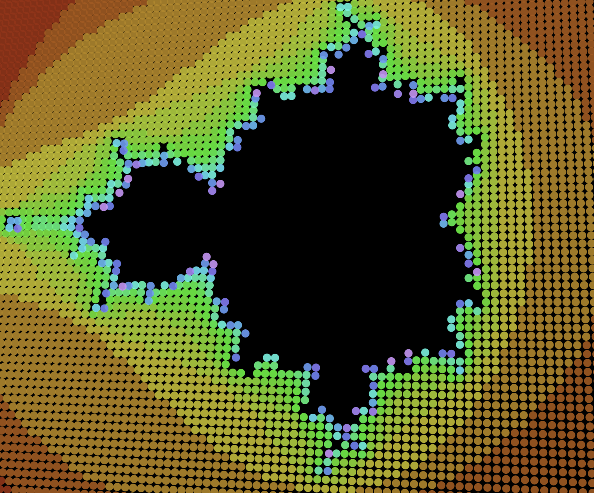

# 3D Mandelbrot Animations in Elm

A modernized Elm demo showcasing animated 3D Mandelbrot set visualizations with rotating perspectives and fractal mathematics.

[](https://ninjaconcept.github.io/elm-mandelbrot-visualization/)

**[🌐 Live Demo](https://ninjaconcept.github.io/elm-mandelbrot-visualization/)**

## Features

- Real-time 3D Mandelbrot set visualization
- Animated fractal parameters with smooth transitions
- Color-mapped fractal escape time visualization

## Setup

1. **Install Elm** (if not already installed):
   ```bash
   npm install -g elm
   ```

2. **Install dependencies**:
   ```bash
   elm install
   ```

3. **Start development server**:
   ```bash
   elm reactor
   ```

4. **View the demo**:
   - Open http://localhost:8000 in your browser
   - Navigate to `src/Main.elm` to see the animation

## Project Structure

- `src/Main.elm` - Main application with Mandelbrot set calculations and 3D rendering
- `elm.json` - Project dependencies and configuration

## Notes

This project has been updated from Elm 0.18 to 0.19.1 with:
- Removed deprecated OpenSolid geometry library
- Custom Mandelbrot set and Julia set mathematical calculations
- 3D projection and rotation mathematics for fractal visualization
- Modern Elm Browser.element architecture
- Optimized fractal iteration algorithms for real-time performance
